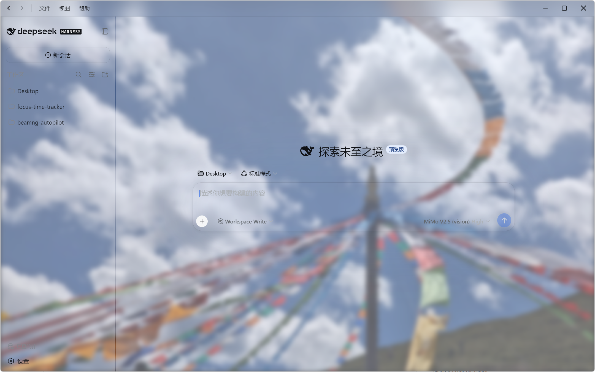
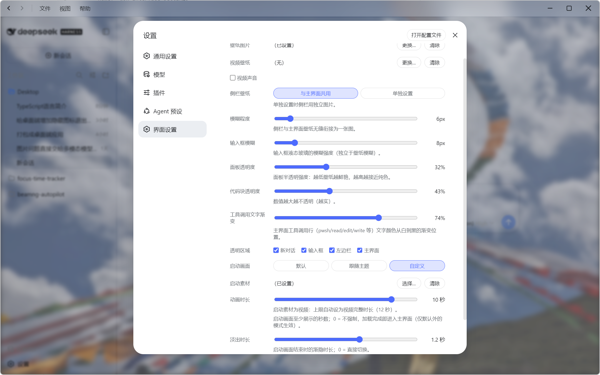
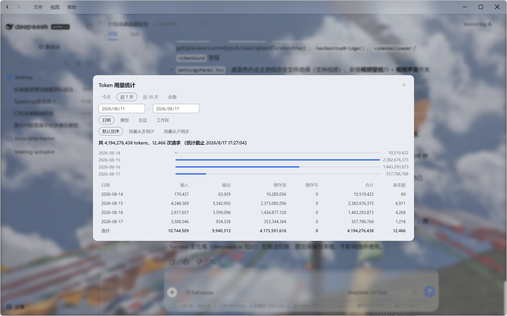

# dsh-desktop（DeepSeek Harness Desktop）

<div align="center">

**中文** | [English](README.en.md)

[](LICENSE)
[](https://github.com/Qiongkura/dsh-desktop/stargazers)
[](https://github.com/Qiongkura/dsh-desktop/issues)

</div>

> [!CAUTION]
> **现已暂停更新**

> [!CAUTION]
> 
> **Token 用量统计已知问题：宽时间范围下数据膨胀**
>
> 用量面板选"近 7 天"等非"今天"范围时，后端折叠逻辑会产生重复样本，Token 总量虚高（偏差可达 2.4 倍）。选"今天"时数据准确。此为 DSH `usage-query` 包的已知 bug，修复前请以"今天"视图为准。

> [!CAUTION]
> **已知问题：后端启动慢（约 30 秒）+ 三段启动动画**
>
> 用 `--dsh-root`/`start-desktop.ps1`（dev 模式）启动时，后端用 `tsx` 从源码跑整个 DSH，冷启动实测约 **33 秒**（内置运行时热启动约 **15 秒**、全新冷启动约 **28 秒**——慢主要是 DSH web 引导本身，不是 tsx）。因后端在 **8 秒** 内未就绪，`main.js` 会触发兜底显示**旧的 splash.html**，于是出现"三段动画"：旧 splash → Web 加载提示（右下角"正在启动服务"）→ 主界面。
>
> 若希望快速启动：**不带 `--dsh-root` 直接双击安装目录的 `DeepSeek Harness Desktop.exe`**，会走内置运行时（约 245MB 生产闭包，入口 `lib/bin.js`）。注意内置模式使用独立数据目录 `AppData\Roaming\DeepSeek Harness Desktop\home`，与 `~/.dsh` 的会话/存储数据相互独立。
>
> 另：`界面设置` 的 `动画时长`（启动画面至少展示秒数）默认 10 秒会进一步拉长启动体感，可调小。

把 DeepSeek Harness 的 Web GUI 装进原生桌面窗口，并深度定制界面外观的独立项目：壁纸 / 毛玻璃 / 液态玻璃 / 启动画面 / 自动转码，全部通过桌面端标题栏/托盘「界面设置」面板一键配置。

- **自包含发行版**：安装包内置完整 DSH 后端运行时（约 250MB 生产闭包），任何 Windows x64 用户下载安装后双击即用，无需安装 Node.js / pnpm / 拉取仓库；
- **Token 用量统计**：内置 runtime 含完整用量统计（侧边栏底部入口）：按日期/模型/会话/工作区分组、Token 排序、子代理用量合并；
- **界面设置**：壁纸、视频壁纸、模糊、区域透明、输入框/轨迹毛玻璃、启动画面（模式/素材/时长/淡出）、HEVC 自动转码……设置面板全部搞定（标题栏/托盘「界面设置…」一键直达，配置统一持久化在 Electron 配置中）；
- **自动探测与接管**：自动探测 `http://127.0.0.1:3080`：GUI 已在运行就直接接管，否则启动内置后端；

## 功能

| 功能 | 说明 |
| --- | --- |
| 壁纸图片/视频 | 标题栏/托盘「界面设置…」选择图片/视频作为界面背景（仅桌面端，Web 端不支持） |
| 壁纸模糊 | 独立滑块（0-100px），壁纸层实时模糊 |
| 代码块透明度 | 独立滑块（8%-100%），对话内代码块底色 |
| 区域透明开关 | 新对话 / 输入框 / 左边栏 / 主界面 四个独立开关 |
| 侧栏独立壁纸 | 左侧栏可单独设置一张壁纸（或与主图共用） |
| 输入框液态玻璃 | 输入区毛玻璃（`backdrop-filter` + 面板色渐变），独立模糊滑块（最低 10px 保证文字必糊） |
| 面板透明度 | 独立滑块（0-90%），面板半透明强度 |
| 轨迹界面毛玻璃 | 与输入框共用同一套玻璃代码与滑块，按颜色饱和度智能透明（保留色条/状态标签） |
| 启动画面 | 默认 / 跟随主题 / 自定义（图片或视频）三种模式 |
| 动画时长 | 0-10 秒滑块；选视频时上限自动 = 视频完整时长（确保能完整播完） |
| 淡出时长 | 0-2 秒滑块，启动画面结束时的渐隐时长 |
| 点击跳过 | 启动动画期间点击任意位置直接跳过（主界面就绪后） |
| HEVC 自动转码 | 检测到 HEVC（H.265）视频自动转码为 H.264（CRF 17 视觉无损），保证硬解流畅 |
| 视频壁纸协议 | `dsh-wallpaper://` 特权协议，流式播放本地视频（支持 Range） |
| 视频声音 | 可选播放壁纸视频的声音 |
| 一体化标题栏 | 自绘标题栏：返回/前进/菜单/最小化/最大化/关闭 |
| Token 用量统计 | 内置最新 DSH runtime：按日期/模型/会话/工作区分组，Token 用量排序，子代理用量自动合并到根会话 |

## 面板展示

| 主界面 | 界面设置 | 用量统计 |
| --- | --- | --- |
|  |  |  |

## 架构与实现

```
┌──────────────────────────────────────────────────┐
│  DeepSeek Harness Desktop (Electron)             │
│  ┌────────────────────────────────────────────┐  │
│  │ main.js 主进程                              │  │
│  │ · 配置/日志/菜单/托盘/单实例                 │  │
│  │ · 后端探测与拉起（attach 或内置 runtime）     │  │
│  │ · dsh-wallpaper:// 特权协议（流式媒体）       │  │
│  │ · 壁纸/玻璃/透明 CSS 注入（injectWallpaperCss）│  │
│  │ · 启动画面媒体解析 + preload payload          │  │
│  │ · HEVC 检测 + ffmpeg 自动转码                │  │
│  │ · 设置对话框（wallpaper-dialog/）             │  │
│  └────────────────────────────────────────────┘  │
│  ┌────────────────────────────────────────────┐  │
│  │ main-preload.js（注入页面脚本前）            │  │
│  │ · 一体化标题栏 contextBridge                │  │
│  │ · 启动层注入（视频层/图片层 + 时长/淡出/跳过） │  │
│  │ · 启动画面模式暴露给页面（dshSplashMode）     │  │
│  └────────────────────────────────────────────┘  │
└──────────────────────────────────────────────────┘
        │ attach / 拉起
        ▼
┌──────────────────────────────────────────────────┐
│ DSH Web GUI (http://127.0.0.1:3080)             │
│ · AppRoot 加载门控（壁纸模式不渲染 HARNESS 卡片）  │
│ · 壁纸/玻璃/透明 全部由主进程注入的 CSS 控制       │
└──────────────────────────────────────────────────┘
```

关键技术点：

- **壁纸层**：`body::before/::after`（负 z-index、不拦截输入、不创建 JS 层）；
- **液态玻璃**：`::before` + `backdrop-filter` + 面板色渐变，图片/视频统一；
- **启动层**：preload 在页面脚本执行前注入（`documentElement` 一出现即就位），z-index 最大，主界面就绪 + 满足时长后淡出移除；
- **轨迹玻璃**：按颜色饱和度智能透明（JS 轮询），不依赖易变的插件类名；
- **自动转码**：编码检测 + ffmpeg（CRF 17 视觉无损）+ 转码版优先；
- **视频时长检测**：ffmpeg `-i` 解析 `Duration`，驱动动画时长滑块上限。

## 目录结构

| 路径 | 说明 |
| --- | --- |
| `main.js` | Electron 主进程：后端管理、壁纸/玻璃/透明注入、启动画面、转码、设置对话框 |
| `main-preload.js` | 主窗口 preload：标题栏能力 + 启动层注入 + 模式暴露 |
| `wallpaper-dialog/` | 界面设置对话框（无边框、可拖拽、置顶于主窗口） |
| `titlebar/` | 一体化标题栏注入（CSS/JS/preload） |
| `close-dialog/` | 关闭确认对话框（隐藏到托盘 / 直接退出） |
| `scripts/build-dist.ps1` | 一键构建：渲染图标 → 部署内置运行时 → 修复闭包 → electron-builder |
| `scripts/transcode-video.ps1` | 手动转码脚本（HEVC → H.264 CRF 17） |
| `scripts/update-release.ps1` | 上传构建产物到 GitHub Release |
| `.toolchain/` | 构建工具链（7za 包装器、镜像服务器、闭包修复、ffmpeg） |

## 📦 环境依赖

```bash
Node.js + pnpm（构建时需要）
DSH 仓库 checkout（可用 `DSH_SOURCE_ROOT` 覆盖）
网络（npmmirror 镜像）
```

## 安装与使用

```powershell
npm install     # 安装 electron + electron-builder（走 npmmirror 镜像）
npm start       # 开发模式启动（attach 本机 3080 或按配置拉起后端）
```

打包 exe：
```powershell
powershell -ExecutionPolicy Bypass -File scripts\build-dist.ps1
```

构建机要求：Node.js + pnpm、DSH 仓库 checkout（可用 `DSH_SOURCE_ROOT` 覆盖）、网络（npmmirror）。产物：portable exe + ZIP，约 300-400MB（内置完整后端 + ffmpeg）。

## 📝 使用示例

```powershell
# 开发模式启动
npm start

# 打包可执行文件
powershell -ExecutionPolicy Bypass -File scripts\build-dist.ps1

# 运行 smoke test
npm run smoke
```

## ⚙️ 配置说明

配置文件：`%APPDATA%\DeepSeek Harness Desktop\config.json`；日志同目录 `logs/`。

| 配置项 | 说明 | 默认 |
| --- | --- | --- |
| `wallpaper` | 壁纸图片/视频路径 | 无 |
| `sidebarWallpaper` | 侧栏独立壁纸 | 共用主图 |
| `wallpaperBlur` | 壁纸模糊 px | 18 |
| `wallpaperCodeAlpha` | 代码块透明度 | 0.45 |
| `transparentNewSession/Input/Sidebar/Main` | 区域透明开关 | true |
| `wallpaperVideoSound` | 视频壁纸声音 | false |
| `glassBlur` | 输入框/轨迹玻璃模糊 px | 10 |
| `panelAlpha` | 面板透明度 | 0.55 |
| `splashMode` | 启动画面模式 default/follow/custom | default |
| `splashFile` | 自定义启动素材 | 无 |
| `splashDuration` | 动画时长（秒） | 0 |
| `splashFade` | 淡出时长（秒） | 0.5 |

## 🧪 测试

```powershell
npm run smoke   # 启动 → 等待页面加载完成 → 打印 SMOKE_OK/SMOKE_FAIL 并退出
```

## 🤝 贡献指南

欢迎提交 Issue 和 Pull Request！

1. Fork 本仓库
2. 创建你的功能分支 (`git checkout -b feature/xxx`)
3. 提交你的修改 (`git commit -m 'feat: 新增xxx功能'`)
4. 推送到分支 (`git push origin feature/xxx`)
5. 打开 Pull Request

## 📄 许可证

本项目采用 [MIT](LICENSE) 许可证。

## 📮 联系方式

- GitHub：https://github.com/Qiongkura
- 微信：Qiongkura

## 已知限制

- 内置运行时不含 `pnpm`，GUI 里的插件安装/管理功能不可用；
- 内置运行时基于构建当时的 DSH 仓库版本，需重新打包跟随上游更新；
- 端口被其他程序占用时会直接接管，请确认该端口上确实是 DSH GUI；
- HEVC 转码首次耗时数分钟（CRF 17 高码率），转码期间使用原片（可能卡顿），完成后自动切换转码版。

## 与相关项目的关系

本项目基于 [deepseek-ai/deepseek-harness](https://github.com/deepseek-ai/deepseek-harness) 构建，负责桌面封装与界面定制；DSH 核心能力、插件系统与 Web UI 来自官方项目。
